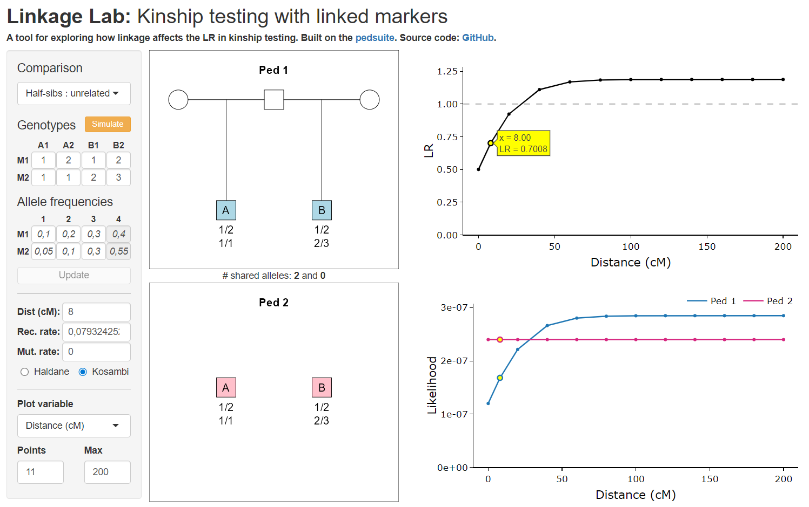

Linkage Lab: Kinship testing with linked markers
================

<!-- README.md is generated from README.Rmd. Please edit that file -->

## Overview

Linkage Lab is a free interactive Shiny app for exploring how genetic
linkage between markers affects likelihood ratios (LR) in forensic
kinship testing.

For a given relationship comparison, the app shows how the LR for a
marker pair depends on:

- the observed genotypes
- the recombination rate between the markers
- the allele frequencies
- the mutation rate

The app is built on the [pedsuite](https://magnusdv.github.io/pedsuite/)
packages for pedigree analysis in R.

## Comparisons included

- Paternity vs unrelated
- Paternity vs siblings
- Siblings vs unrelated
- Siblings vs half-siblings
- Half-siblings vs unrelated
- Half-siblings vs grandparent
- Half-siblings vs avuncular
- Grandparent vs unrelated
- Grandparent vs avuncular
- Avuncular vs unrelated

## Live app

<https://magnusdv.shinyapps.io/linkagelab/>
